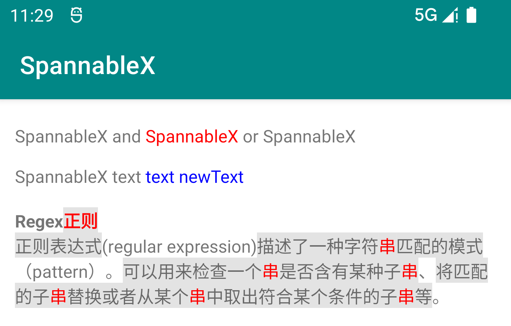

***SpnnableX*** 支持强大的 ***Span*** 效果替换，及 ***文本*** 替换。

SpnnableX内部的Span效果，无论使用 *DSL* 或 *链式* ，都有一个 *replaceRule: Any?* 的参数
该参数支持9种类型:

- *[String](#string)*、*Array&lt;String&gt;*、*List&lt;String&gt;*
- *[Regex](#regex)*、*Array&lt;Regex&gt;*、*List&lt;Regex&gt;*
- *[ReplaceRule](#replacerule)*、*Array&lt;ReplaceRule&gt;*、*List&lt;ReplaceRule&gt;*


``` kotlin
// dsl
TextView.text = spannable {
    // 只给bold text附加粗体效果
    "bold text, real text.".style(Typeface.BOLD, "bold text")
}

// 链式
TextView.text = Span.create()
	// 只给bold text附加粗体效果
	.text("bold text, real text.").style(Typeface.BOLD, "bold text")
	.spannable()
```


## String

当 *replaceRule: Any?* 传入的类型为 *String* 或 *Array&lt;String&gt;* *List&lt;String&gt;* 时，会寻找传入的文本，并替换指定Span效果。

``` kotlin
TextView.text = spannable {
    // 只给bold text附加粗体效果
    "bold text, real text.".style(Typeface.BOLD, "bold text")
}
```

***Array&lt;String&gt;*** & ***List&lt;string&gt;*** 示例:

- kotlin

``` kotlin
TextView.text = spannable {
    // 给bold text和粗体文本附加粗体效果
    "1. bold text, real text. 粗体文本".style(Typeface.BOLD, arrayof("bold text", "粗体文本"))
    "2. bold text, real text. 粗体文本".style(Typeface.BOLD, listof("bold text", "粗体文本"))
}
```

- Java

``` java
List&lt;String&gt; replaceList = new ArrayList&lt;&gt;();
replaceList.add("bold text");
replaceList.add("粗体文本");

TextView.setText(Span.create()
    // 给bold text和粗体文本附加粗体效果
	.text("1. bold text, real text. 粗体文本")
    .style(Typeface.BOLD, new String[]{"bold text", "粗体文本"})
	.text("2. bold text, real text. 粗体文本")
    .style(Typeface.BOLD, replaceList)
	.spannable()
);
```


## Regex正则

当 *replaceRule: Any?* 传入的类型为 *Regex* 或 *Array&lt;Regex&gt;* *List&lt;Regex&gt;*时，会寻找传入的正则，并替换指定Span效果。

``` kotlin
TextView.text = spannable {
	// 只给邮箱设置红色文本
	"email: spannablex@itxca.com or github@itxca.com"
		.color(Color.RED, "\\w+([-+.]\\w+)*@\\w+([-.]\\w+)*\\.\\w+([-.]\\w+)*".toRegex())
}
```

***Array&lt;Regex&gt;*** &  ***List&lt;Regex&gt;*** 可参考[String](#string)替换的数组及列表操作。


## ReplaceRule

***SpannableX*** 定义的替换规则，可使用 *String.toReplaceRule()* 或 *Span.toReplaceRule()* (Java使用)构建。

``` kotlin
// Kotlin扩展方法
"bold".toReplaceRule()

// Java可使用Span的静态方法
Span.toReplaceRule("bold")
```

*ReplaceRule* 的附加参数为

> 未接触过Kotlin的开发者说明，类型后面带?的定义是可空类型。相当于 *@Nullable*

``` kotlin
"bold".toReplaceRule(
    // 扩展方法receiver 或 Span.toReplaceRule的第一个参数是否为正则
	isRegex: Boolean = false,
    
    // 单一匹配位置 若下一个参数matchRange不为null时，优先使用matchRange
    // 下标从0开始
	matchIndex: Int? = null,
    
    // 匹配范围，null则匹配全部
    // 下标从0开始
	matchRange: IntRange? = null,
    
    // 匹配到后是否替换文本(null 为不替换)
	newString: CharSequence? = null,
    
    // 有匹配项时回调
	replacementMatch: OnSpanReplacementMatch? = null
)
```

**示例**



``` kotlin
TextView.text = spannable {
    // 查找第1个`SpannableX`，替换文本效果为红色、加粗、斜体（下标从0开始）
    "SpannableX and SpannableX or SpannableX"
        .span("SpannableX".toReplaceRule(matchIndex = 1)) {
            color(Color.RED)
            style(Typeface.BOLD and Typeface.ITALIC)
        }

    newline(2)

    "SpannableX text text text".color(
        Color.BLUE, arrayOf(
            // 查找第1到第2个`text`，文本替换为蓝色（下标从0开始）
            "text".toReplaceRule(matchRange = 1..2),
            
            // 且第匹配到的第2个`text`文本替换为`newText`
            "text".toReplaceRule(matchIndex = 2, newString = "newText")
        )
    )

    newline(2)

    """
        Regex正则
        正则表达式(regular expression)描述了一种字符串匹配的模式（pattern）。可以用来检查一个串是否含有某种子串、将匹配的子串替换或者从某个串中取出符合某个条件的子串等。
    """.trimIndent().span {
        // 查找全部`Regex正则`替换为蓝色
        style(Typeface.BOLD, "Regex正则".toReplaceRule())
		
        // 查找中文，添加背景色
        background("#e3e3e3".color, "[\\u4e00-\\u9fa5]+".toReplaceRule(true))

        // 查找第0个`正则`和全部的`串`替换为红色
        color(
            Color.RED, arrayOf(
                "正则".toReplaceRule(matchIndex = 0),
                "串".toReplaceRule()
            )
        )
    }
}
```


***Array&lt;ReplaceRule&gt;*** & ***List&lt;ReplaceRule&gt;*** 可参考[String](#string)替换的数组及列表操作。


## 其它说明

**👉 常用Span(DSL、链式通用):** [常用Span](https://txca.github.io/SpannableX/spans/)

**👉 Kotlin|Java 链式 Sample:**  [JavaSample](https://github.com/TxcA/SpannableX/blob/master/app/src/main/java/com/itxca/sample/spannable/JavaFragment.kt)

**👉 Kotlin DSL Sample:**  [KotlinSample](https://github.com/TxcA/SpannableX/blob/master/app/src/main/java/com/itxca/sample/spannable/KotlinFragment.kt)